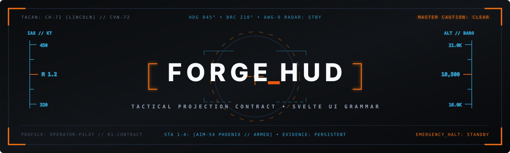

<div align="center">

  

  <br/>

  [](#unified-delivery-sequence)
  [](#package-and-contracts)
  [](#)
  [](#)

  <h3>Tactical Heads-Up Display &amp; UI Grammar for the Forge Ecosystem</h3>

  <p align="center">
    A props-driven, high-contrast visual projection engine built for operators and creators.<br/>
    Strictly separates presentation roles from backend authority.
  </p>

  <p align="center">
    <a href="#decision">Architecture Decision</a> •
    <a href="#unified-delivery-sequence">Delivery Roadmap (R0–R7)</a> •
    <a href="#resolved-conflicts">Authority Contracts</a> •
    <a href="#initial-r1-file-allowlist">R1 Allowlist</a>
  </p>

</div>

---
# ForgeHUD

Repository: `Boswell-Digital-Solutions/forge-hud`.

ForgeHUD is a shared governance-presentation library for Forge applications.
Current code snapshot — 2026-09-27: canonical documentation and implementation
planning are present; runtime packages are planned, not implemented.

## Documentation Contract

- **Role:** library/toolkit repository; this README is the entrypoint overview.
- **Boundary:** ForgeHUD owns portable presentation. Existing applications/backends
  retain state, readiness, allowed actions and authorization authority.
- **Doc authority:** [doc/system/_index.md](doc/system/_index.md) and its generated
  [doc/fhdSYSTEM.md](doc/fhdSYSTEM.md) are the repository's canonical deep reference.
  Edit the modular chapters; never edit the generated aggregate directly.
- **Truth-class note:** dated status and measurements are snapshots. Planned
  capabilities are not implementation claims.

## Build and verify documentation

```bash
bash doc/system/BUILD.sh
python3 scripts/check_docs.py
```

No package installation is required. There is no runtime startup command yet.
Prefix `fhd` and the documentation surface await central Forge registry admission;
local documentation checks do not claim ecosystem-wide certification.

## Implementation planning

- [Reconciled ForgeHUD and UI Grammar plan](docs/plans/forge-ui-grammar/RECONCILED-PLAN.md)
- [R1 file scope](docs/plans/forge-ui-grammar/r1-scope.json)
- [Source evidence manifest](docs/plans/forge-ui-grammar/evidence/source-lock.json)
- [Documentation metadata](doc/documentation-manifest.json)

The first planned runtime delivery is `forge-hud-svelte`. Backend extraction,
receipt signing and advanced fatigue work remain later roadmap slices. Source
snapshot paths in the evidence manifest refer to the originating task-local CP0
packet, not source code shipped by this repository.
