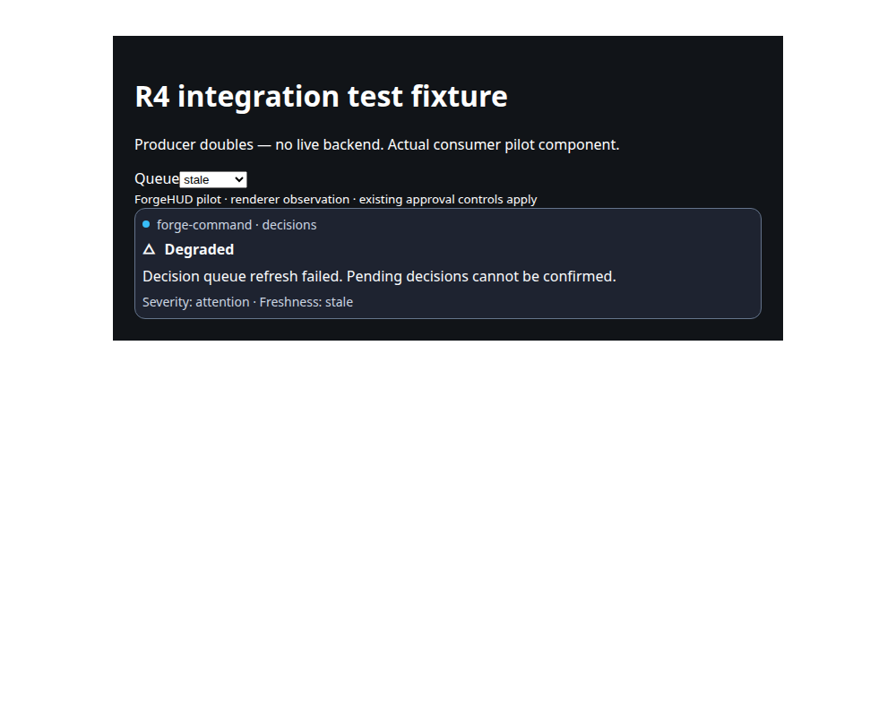
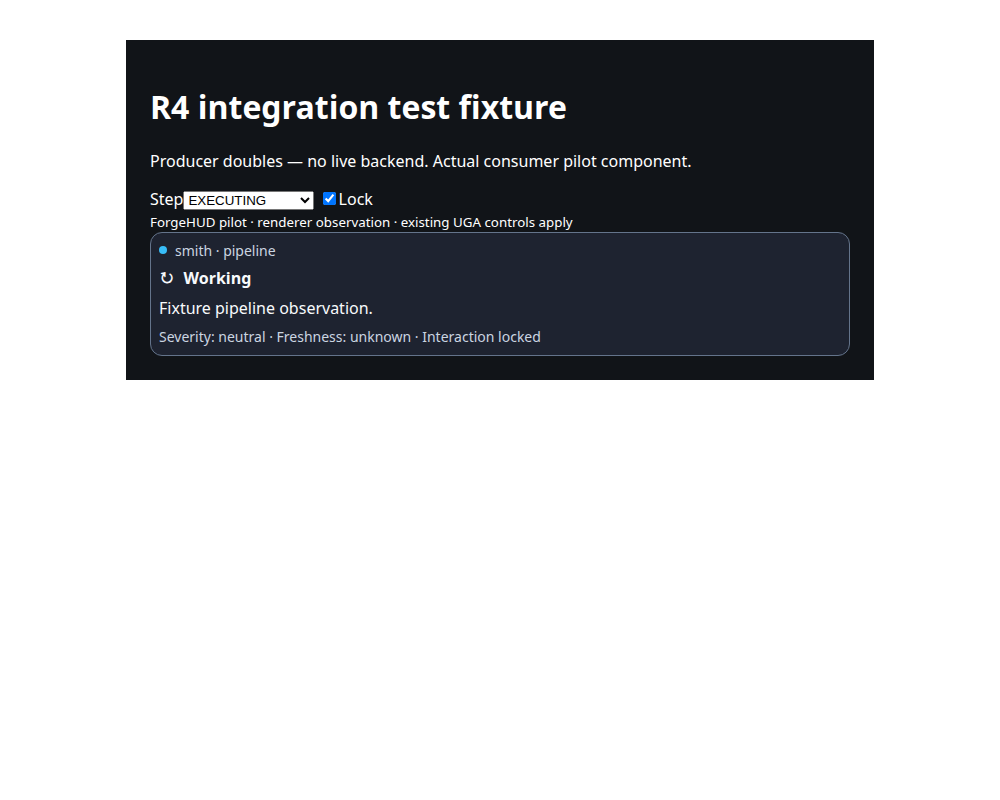
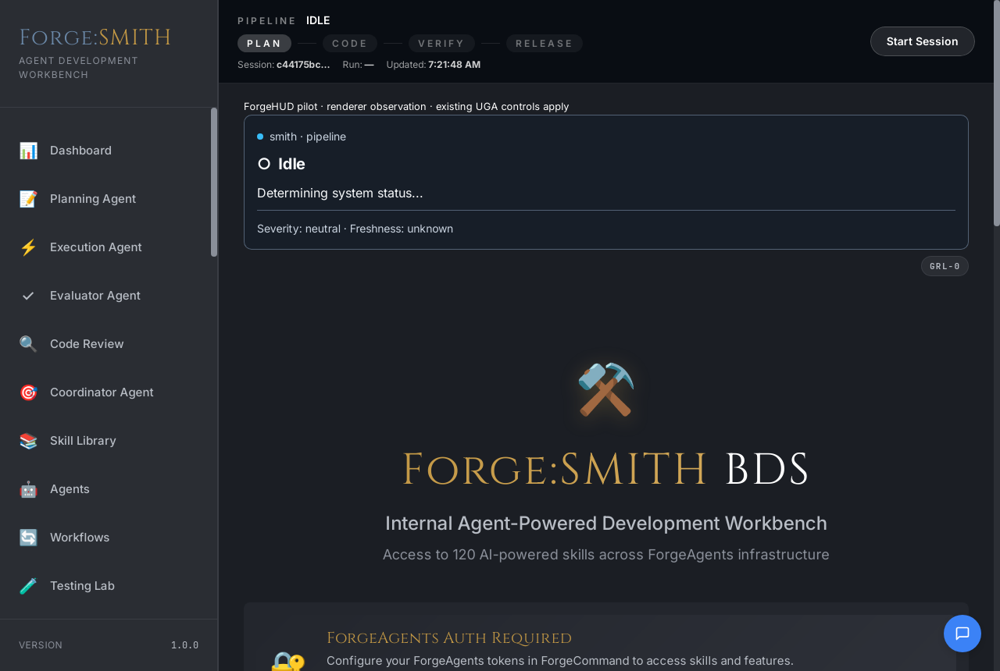
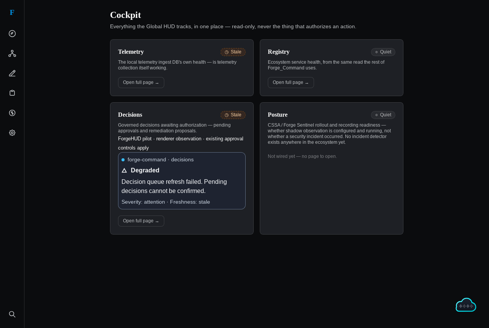

# R4 — default-off operator pilot integrations

Snapshot: 2026-09-27. R3 merge verified at `514481a`.
[Scope](r4-scope.json) · [Consumer revisions and source hashes](r4-consumers.json).

## Implemented

- [Forge Command PR #365](https://github.com/Boswell-Digital-Solutions/Forge_Command/pull/365):
  one decision-status capsule inside the existing Cockpit slice, bound to
  `getDecisionsLaneState`. Existing Work navigation and approval controls remain.
- [SMITH PR #145](https://github.com/Boswell-Digital-Solutions/forge-smithy/pull/145):
  one pipeline-status capsule bound to existing pipeline/readiness stores.
  [The mounting correction](https://github.com/Boswell-Digital-Solutions/forge-smithy/pull/146)
  moved it into the production `AppViewport` below `PipelineHud`, because the
  earlier Next Action card was not mounted. Existing UGA and remediation
  callbacks remain.

Both are off unless `VITE_FORGE_HUD_PILOT=true` at build/dev time. Neither produces
allowed action IDs, changes authority rules, polls independently, or issues receipts.
Command decision `halt` remains awaiting approval; stale queues remain degraded.
SMITH locked execution remains working, with separate readiness severity. Unknown
or contradictory native states remain unavailable. Observation time is renderer
projection time; unknown backend freshness is explicitly retained.

## Distribution

Both consumers include 16 unchanged ForgeHUD source files pinned to the R3 merge,
with per-file SHA-256 provenance. This internal pilot distribution avoids an
unpublished package dependency and leaves package locks unchanged. Sources must not
be edited downstream. `scripts/check_pilot_vendor.py` compares every source byte
and hash against the pinned Git commit. Both consumers pass this check.

## Verification

| Check | Command | SMITH |
| --- | --- | --- |
| Focused and existing regression tests | 26 pass: pilot, HUD lanes, CockpitContent | 34 pass: pilot, pipeline authority, UGA config |
| Full Svelte check | 0 errors, 0 warnings | 0 errors, 0 warnings |
| Pilot-enabled production build | Pass | Pass |
| Chromium integration fixture | 1 pass | 1 pass |
| Screenshot inspection | Persistent degradation | Locked working |

The Chromium tests mount the actual consumer pilot components with clearly marked
producer doubles. They prove reactive state wiring and fail-closed presentation,
not backend connectivity or native acceptance. The test-only SMITH Vite configuration
uses an ESNext dependency target for current Chromium after its default optimizer
target failed against the existing cache. Production build configuration is unchanged.

Existing local dependencies were reused. Command used Node 22.21.1 for validation;
its declared deployment engine is Node 24, so Node 24 CI remains required. SMITH
used Node 20.19.6. No Rust changes were made or native qualification claimed.

## Native follow-up — 2026-09-30

Task: verify the default-off R4 pilots on current native consumer mounts.
Touched plane: business-local presentation and local test evidence. Business-local
systems: SMITH and Forge Command. Public app-local systems: none. Cloud systems:
none. External agent surface: Codex Tauri WebDriver and GitHub review. Data
boundary: read-only renderer state in disposable profiles; no keys, decision
contents or generated output retained. Authority owner: operators retain pilot
activation and evidence acceptance. Evidence destination: this report and the
two screenshots below. Cloud escalation: none. Human approval gate: no
authority-changing action was performed; rollout acceptance remains human-owned.

The flag-enabled SMITH frontend and native binary used the file tree merged at
[`4f455a2`](https://github.com/Boswell-Digital-Solutions/forge-smithy/commit/4f455a258630f0625d91d5e4ee8fc57d703b7907).
On the real native dashboard, one pilot appeared below `PipelineHud`. With a
disposable profile lacking a ForgeAgents credential, it projected the actual
idle pipeline state and unknown freshness, announced its source and status
politely, and added no focusable controls. The separate ForgeAgents-auth banner
remained visible. The native screenshot shows this initial state; it does not
prove working, verifying or locked states in a live native session. The existing
browser harness passed with the pilot flag both on and off.

Forge Command used current `main` at
[`93f6039`](https://github.com/Boswell-Digital-Solutions/Forge_Command/commit/93f60391bca89d29362718c54391db0798ed9b86).
Its native Cockpit showed one decision pilot. In the disposable profile, the
decision queue could not be confirmed, so both the existing lane badge and the
pilot reported stale; the pilot projected `degraded`, explained the failed
refresh, announced politely, and added no focusable controls. The existing
operator desktop and dev server owned ports 8790 and 1420; this run used a
disposable bridge on 18790 and a flag-enabled Vite server on 1422. The temporary
Vite server denied fonts from a symlinked dependency cache, so this screenshot
proves mount and status behavior but not final font fidelity. The focused
Chromium pilot test also passed against current `main`.

Both native binaries compiled offline. SMITH's flag-enabled Vite build and
service-worker generation completed; Command's flag-enabled production build
completed. Native WebDriver checks verified one labeled pilot, status role,
announcement, no pilot actions, and screenshots. These runs did not change the
consumer repositories or the default-off flags. The disposable Command server
and desktop were stopped after capture; the pre-existing 8790/1420 processes
were not changed.

## Acceptance still open

R4 is implemented for opt-in evaluation, not fully accepted for rollout. Native
mounting and one real store state in each consumer are now observed. A native
pending-approval decision state, SMITH working/locked transitions for this
specific pilot, human screen-reader review, and CI review remain open.
Keep both defaults off until accepted. No source provides a new authenticated
emergency-halt feed in this slice. R5 creator work remains separate; it must not be
used to mark these acceptance items complete.
